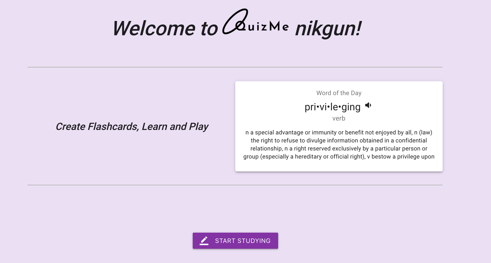
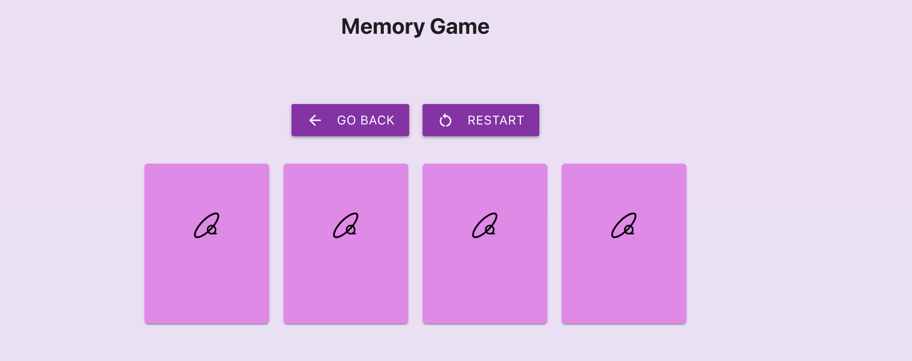
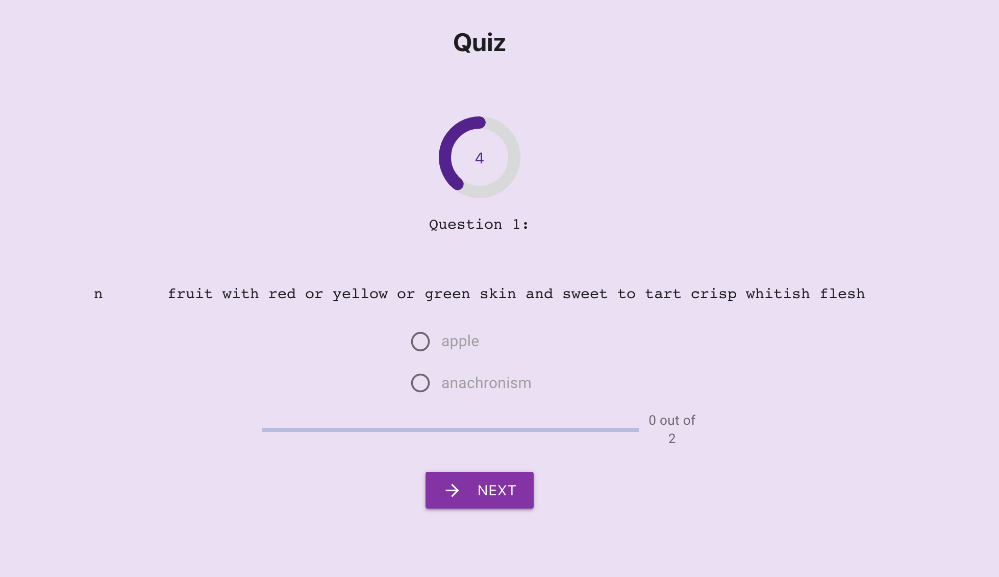

<!-- PROJECT SHIELDS -->
<!--
*** I'm using markdown "reference style" links for readability.
*** Reference links are enclosed in brackets [ ] instead of parentheses ( ).
*** See the bottom of this document for the declaration of the reference variables
*** for contributors-url, forks-url, etc. This is an optional, concise syntax you may use.
*** https://www.markdownguide.org/basic-syntax/#reference-style-links
-->
[![Contributors][contributors-shield]][contributors-url]
[![Forks][forks-shield]][forks-url]
[![Stargazers][stars-shield]][stars-url]
[![Issues][issues-shield]][issues-url]
[![MIT License][license-shield]][license-url]
[![LinkedIn][linkedin-shield]][linkedin-url]

<p align="center">
  <a href="https://ketolifeapp.herokuapp.com/">
    
  </a>
  <h3 align="center">QuizMe React Application</h3>
</p>
<br/>

<p align="center">
    
</p>
<br />


<!-- TABLE OF CONTENTS -->
## Table of Contents

* [About the Project](#about-the-project)
  * [Built With](#built-with)
* [Getting Started](#getting-started)
  * [Prerequisites](#prerequisites)
  * [Installation](#installation)
* [Usage](#usage)
* [Roadmap](#roadmap)
* [Contributing](#contributing)
* [License](#license)
* [Contact](#contact)
* [Acknowledgements](#acknowledgements)


<!-- ABOUT THE PROJECT -->
## About The Project  

https://quizme-app.netlify.app/  
  
The purpose of the following application is learning English words by playing games,
creating quizes and internalize those words by doing different activities. Going ahead it should not to be necessarily limited to english language but can be later extended to different subcategories like learning science/math/biology/preparing for exam and creating flashcards for any class etc.  
This is React application built with modern functional components and hooks like useState,useEffect, useRef, useHistory and also react-hook-form. For storage, Redux store was utilized including types, actions and reducers. For visuals, Material UI with combination of Materialize CSS was used to achieve desired positioning of components and make the task somewhat easier. Responsiveness is almost fully achieved, just some more touches needed to accomplish this goal. To insure correct type usage, I used Typescript in this project. 

### Built With

* [React.js](https://reactjs.org/)  
* [Redux](https://redux.js.org/)  
* [Typescript](https://www.typescriptlang.org/)  
* [Material UI](https://material-ui.com/)  
* [MaterializeCSS](https://materializecss.com/)  
* [Yup](https://www.npmjs.com/package/yup)  
* [React-Hook-Form](https://react-hook-form.com/) 
* [Datamuse API](http://api.datamuse.com/)
* [ResponsiveVoice API](https://responsivevoice.org/text-to-speech-languages) 
* [Firebase Cloud Service](https://firebase.google.com/) 
* [Netlify](https://www.netlify.com/)

<code></code>
<code></code>
<code></code>
<code></code>
<code></code>
<code></code>
<code></code>
<code></code>
<code></code>  
<code></code>  


## Getting Started

This is an example of how you may give instructions on setting up your project locally.
To get a local copy up and running follow these simple example steps.

### Prerequisites

This is an example of how to list things you need to use the software and how to install them. Make sure you have the last version of Node.js installed on your machine. 

```sh
npm install
```
or
```sh
yarn install
```
To get all dependencies by using npm or yarn, does not matter, your  choice.
### Installation

1. Clone the repo 

```sh
https://github.com/nikgun1984/quizme-client

```
3. Install all dependencies 
```sh
yarn install 
```
4. Run yarn start.  
5. Enjoy and do not forget rate me on GitHub and support me!!!


<!-- USAGE EXAMPLES -->
## Usage. 
Welcome Screen with Word of the day:


# WHAT IS DONE:  
- Registration/Login
- Authorization/Authentication/Tokenization/localStorage
- Screen when signed in/login screen/registration screen/build up study sets screen  
- Working Studyset creation
- Verifications for forms with Yup
- Autocomplete with forms
- Design anf themes for the app
- Voice for study sets. 
- Firebase to store images. 
- Studyset submission.  
- Displaying sets.  
- Study sets by using flashcards:
  - Pronounciation sound effects/Carousel for flashcards/Card Flip/Progress Bar/Shuffle Cards.  
- Memory Game with Words.  
- Created Redux Store for easier access of user's subsets. 
- Implemented shuffle for cards and progress bar. 
- Quizes for studysets. 
- Deletion of studysets/flashcards and ability to edit studysets


Other Illustrations:  
Creation of Studyset that consists of flashcards:
. 
Studysets of a user    

Study and Practice your topics with cool graphical interface:  

Memory Game to internalize the terminology of flashcards:  

At last you can practice and test yourself the learned material:  

 
<!-- ROADMAP -->
## Roadmap

See the [open issues](https://github.com/othneildrew/Best-README-Template/issues) for a list of proposed features (and known issues).


<!-- CONTRIBUTING -->
## Contributing

Contributions are what make the open source community such an amazing place to be learn, inspire, and create. Any contributions you make are **greatly appreciated**.

1. Fork the Project
2. Create your Feature Branch (`git checkout -b feature/AmazingFeature`)
3. Commit your Changes (`git commit -m 'Add some AmazingFeature'`)
4. Push to the Branch (`git push origin feature/AmazingFeature`)
5. Open a Pull Request


<!-- LICENSE -->
## License

Distributed under the MIT License. See `LICENSE` for more information.


<!-- CONTACT -->
## Contact

Nick Gundobin - [@my_email](https://mail.google.com/mail/u/0/?view=cm&fs=1&to=ngundobin@gmail.com&su=SUBJECT&body=BODY&bcc=ngundobin@gmail.com&tf=1) - ngundobin@gmail.com  
[@my slack](sbcommunity-sec.slack.com/U017AUYK05T) - nick_g(slack)

Project Link: [https://github.com/nikgun1984/quizme-client
](https://github.com/nikgun1984/quizme-client)


<!-- ACKNOWLEDGEMENTS -->
## Acknowledgements
* [Img Shields](https://shields.io)
* [Springboard Staff](https://springboard.com)
* [othneildrew YOU ROCK!!!](https://github.com/othneildrew/Best-README-Template)
* [Heroku](https://www.heroku.com/)
* [Renish](https://github.com/renishb10)


<!-- MARKDOWN LINKS & IMAGES -->
<!-- https://www.markdownguide.org/basic-syntax/#reference-style-links -->
[contributors-shield]: https://img.shields.io/badge/contributors-2-green
[contributors-url]: https://github.com/nikgun1984/ketolife_backend/network/dependencies
[forks-shield]: https://img.shields.io/badge/forks-0-red
[forks-url]: https://github.com/nikgun1984/ketolife_backend/network/members
[stars-shield]: https://img.shields.io/badge/stars-0-blue
[stars-url]: https://github.com/nikgun1984/ketolife_backend/stargazers
[issues-shield]: https://img.shields.io/badge/issues-0-yellow
[issues-url]: https://github.com/nikgun1984/ketolife_backend/issues
[license-shield]: https://img.shields.io/badge/license-MIT-yellowgreen
[license-url]: https://github.com/nikgun1984/ketolife_backend/blob/main/README.md
[linkedin-shield]: https://img.shields.io/badge/-LinkedIn-black.svg?style=flat-square&logo=linkedin&colorB=555
[linkedin-url]: https://www.linkedin.com/in/nick-gundobin-5b905931/
[product-screenshot]: images/screenshot.png
=======
