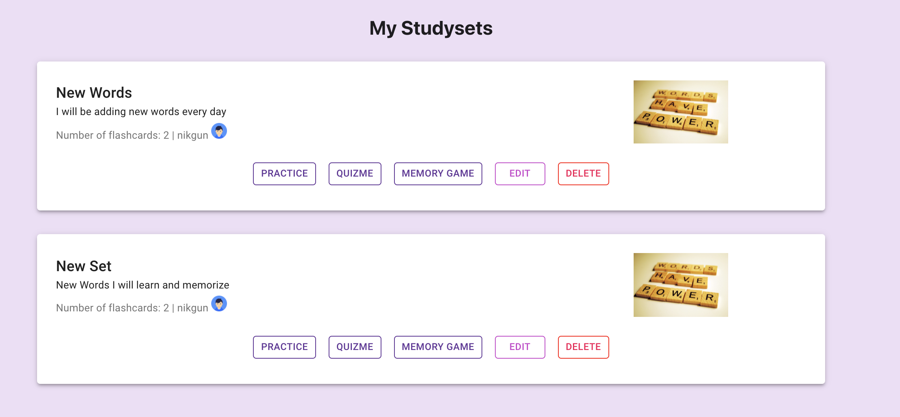

# React App -- QuizMe 

Technologies:  
- React.js (React and react-dom libraries)
- React Testing Library. 
- Typescript. 
- Material UI. 
- MaterializeCSS.  
- Yup -- cool tool for data verification
- useForm API. -- very complex but very efficient form data
- http://api.datamuse.com/ API  
- https://responsivevoice.org/text-to-speech-languages/ API. 
- Firebase Cloud Service. 
- Redux/Thunk

# WHAT IS DONE:  
- Registration/Login
- Authorization/Authentication/Tokenization/localStorage
- Screen when signed in/login screen/registration screen/build up study sets screen  
- Working Studyset creation
- Verifications for forms with Yup
- Autocomplete with forms
- Design anf themes for the app
- Voice for study sets. 
- Firebase to store images. 
- Studyset submission.  
- Displaying sets.  
- Study sets by using flashcards:
  - Pronounciation sound effects/Carousel for flashcards/Card Flip/Progress Bar/Shuffle Cards.  
- Memory Game with Words.  
- Created Redux Store for easier access of user's subsets

# NEXT TO-DO
- Searching for other sets
- Quizzes for sets
- Maybe Testing if I got time. 

Other Illustrations:  
Creation of Studyset that consists of flashcards:
. 
Studysets that the user has.  

Study and Practice your topics with cool graphical interface:  

